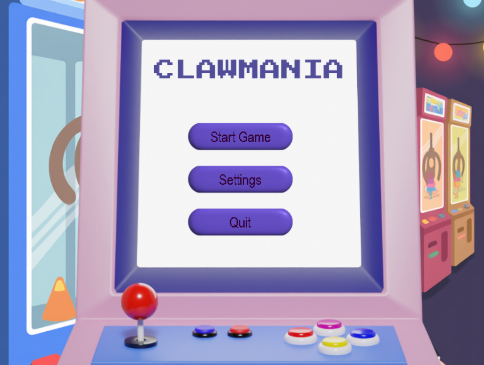
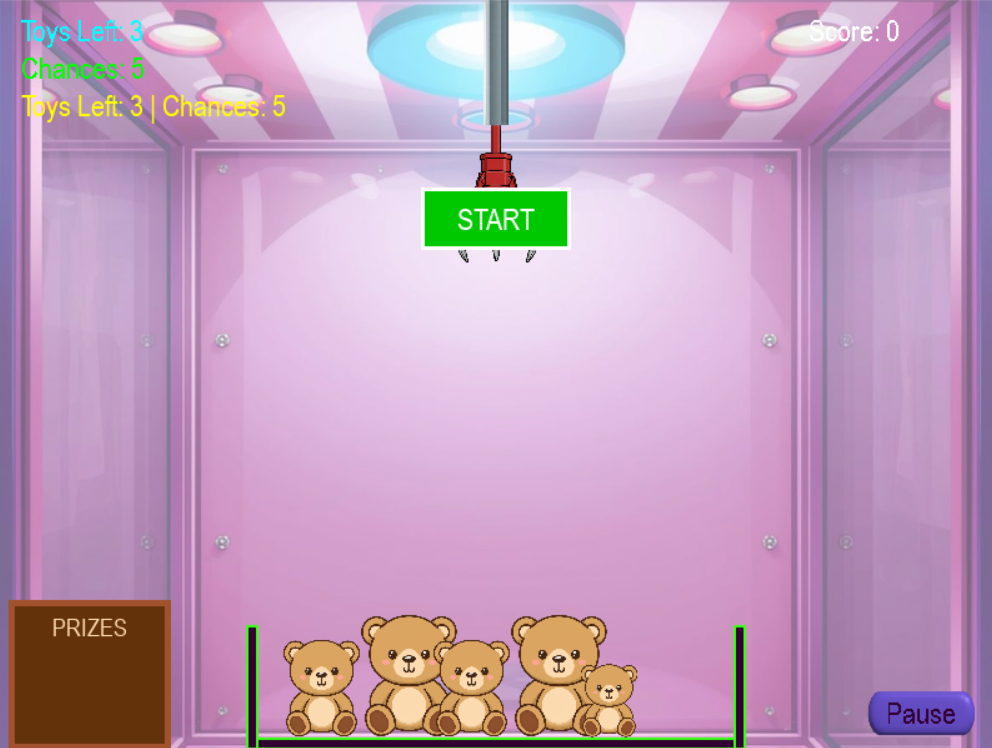

# 🎮 ClawMania  
**A Probabilistic Claw Machine Simulation**

---

## 📌 Overview

ClawMania is a 2D claw machine simulation built using **Python and Pygame**.  
It models realistic claw behavior using probability, alignment sensitivity, grip strength variation, and time constraints.

The project is designed as a **discrete-time stochastic simulation**, allowing experimentation with claw mechanics without requiring physical hardware.

---

## 🖼 Screenshots

### 🏠 Main Menu


### 🎯 Gameplay



---

## 🎯 Objectives

- Simulate realistic claw machine mechanics  
- Model probabilistic grab and slip behavior  
- Implement parameter-based difficulty levels  
- Enable experimental performance analysis  

---

## 🧠 Simulation Concepts

### 1️⃣ Discrete Time-Step Simulation

The game runs at 60 FPS:

```python
clock.tick(FPS)
```

Physics, movement, and timers update every frame to ensure smooth and predictable real-time behavior.

---

### 2️⃣ Probabilistic Grab Model

Grab success is calculated using:

\[
P_{grab} = G \times A \times T \times D
\]

Where:

- **G** → Grip strength  
- **A** → Alignment accuracy  
- **T** → Toy difficulty factor  
- **D** → Environment modifier  

The probability is compared with:

```python
random.random()
```

This generates a value between 0 and 1, ensuring non-deterministic outcomes similar to real claw machines.

---

### 3️⃣ Entity-Based Modeling

The system uses modular object-oriented design:

- **Claw** → Movement, FSM states, grab handling  
- **Toy** → Position, gravity, difficulty  
- **Bin** → Lateral movement and boundaries  

Each entity updates independently within the main game loop.

---

### 4️⃣ Hybrid System

**Continuous variables**
- Position (x, y)
- Velocity (vx, vy)
- Timer countdown
- Grip decay  

**Discrete events**
- Key press  
- Collision detection  
- Grab success or failure  

---

## 🚀 Features

- Draggable claw with collision detection  
- Practice Mode with adjustable grip strength  
- Probability-based grab and slip events  
- Coin-based reward system  
- Level-based difficulty variation  
- Turn timer system  
- XP and progression saved using JSON  

---

## 🎮 Levels

Each level modifies simulation parameters instead of changing core logic.

| Level | Grip Strength | Timer | Special Features |
|--------|---------------|--------|-----------------|
| Level 1 | High (0.95) | 12s | Stable drop |
| Level 2 | Medium (0.6) | 9s | Moving bin |
| Level 3 | Low (0.5) | 7s | Faster bin & unstable drop |

This allows controlled comparison of mechanical difficulty and success probability.

---

## 📊 Performance Metrics

The system tracks:

- Attempts used  
- Toys collected  
- Time remaining  
- XP gained  

These metrics support simulation-based evaluation and experimental analysis.

---

## 🛠 Technical Stack

- Python  
- Pygame  
- Object-Oriented Programming (OOP)  
- Finite State Machine (FSM)  
- Random module (stochastic modeling)  
- JSON (data persistence)  

---

## ▶ How to Run

1. Install Python 3  
2. Install Pygame:

```bash
pip install pygame
```

3. Run the game:

```bash
python main.py
```

---

## 📌 Summary

ClawMania is a parameter-driven stochastic simulation of claw machine mechanics.  
It combines physics, probability, and discrete-time modeling to replicate real-world mechanical uncertainty in a virtual environment.

This makes it suitable as both a playable game and an academic simulation project.
